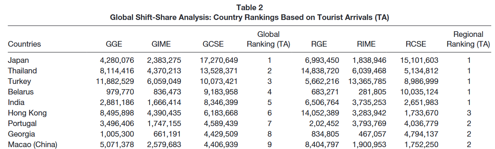

## Contexto OE1

| OE | Perguntas de pesquisa | Materiais | Métodos |
|---|---|---|---|
| OE1.1 | Como evoluiu a participação do Brasil no turismo   internacional entre 2010 e 2024 em comparação a destinos concorrentes? | OMT/WB | Shift-Share  |
| OE1.2 | Há diferenças na evolução da participação do Brasil em   mercados emissores mais sensíveis às mudanças climáticas? | OMT/OCDE | Shift-Share  |
| OE1.3 | Quais fatores estruturais e conjunturais explicam   variações no desempenho do Brasil em termos de chegadas e receitas? | OMT/WB | Shift-Share  |
| OE1.4 | Em que medida choques externos (megaeventos,   recessões, pandemia) afetaram a competitividade internacional do turismo   brasileiro? | OMT/WB | Event Study  |

## Análise shift-share

Since the **early 1960s**, the SSA has been applied in **many fields**, such as spatial economics (Curtis, 1972), political economics (Glickman & Glasmeier, 1989), geography (Plane, 1987), urban planning (Stilwell, 1969), and international trade (Cheptea et al., 2005).

From an economic theoretical perspective, application of the shift-share technique in alternative contexts can demonstrate its efficacy and adaptability in **analyzing the changes in tourism development in a particular country or region based on the global economic growth, global industry growth, and global competitive growth**. 

Tourism development in a country can be attributed to the aggregate of three indicators, which we term as:

- the **global growth effect** (GGE):

  measures tourism development in a country that would have occurred in the country if tourism had developed equivalent to the development of the global economy.
  
  The GGE shows the extent to which tourism development in the country is attributable to the overall economic development in the world.

- the **global industrial mix effect** (GIME):

  links the differential rate of growth in tourism development in the country under investigation to the weaknesses and strengths of the global tourism industry

- the **global competitive share effect** (GCSE).

  measures the extent to which tourism development is driven by the country’s competitiveness in the tourism industry. That is, this measure indicates whether the country under examination (e.g., The United States) is relatively competitive in capturing a greater share of tourist arrivals and/or tourism receipts compared with the capture rate of other countries in the world.
  


::: {.callout-note title="Fonte"}
Dogru, T., Suess, C., & Sirakaya-Turk, E. (2021). Why do some countries prosper more in tourism than others? Global competitiveness of tourism development. Journal of Hospitality & Tourism Research, 45(1), 215–256. https://doi.org/10.1177/1096348020911706
:::


## Dados

- ONU Turismo

  - UN Tourism Data Dashboard: https://www.untourism.int/tourism-data/un-tourism-tourism-dashboard
  
  - Tourism Statistics Database: https://www.untourism.int/tourism-statistics/tourism-statistics-database

- Qualidade ruim: ausência de dados de anos e de países.

- Não consegui checar com resultados anuais publicados.

- Usei período 2003 a 2019.

## Resultados sobre chegadas turísticas internacionais

### Importação dos dados
```{r}
# Shift-share dinâmico (turismo receptivo) com REAT::shiftd ----
rm(list = ls(all=T))
library(tidyverse)
library(magrittr)
library(REAT)
library(readxl)

pais_alvo <- "Brazil"

# Importa dados da OMT ---
path <- "data/UN_Tourism_inbound_arrivals_by_region_10_2025.xlsx"
bd_raw <- readxl::read_excel(path, 
                             sheet = "Data",
                             col_types = c("text", "text", "text", "numeric", "text", "numeric",
                                           "text","numeric","numeric","text","text","text",
                                           "text","text")) |> 
          janitor::clean_names()
```

### Preparação dos dados
```{r}
# Total de turistas por país e ano ----
bd_pa <- bd_raw |>
  filter(is.na(partner_area_label) | partner_area_label != "World") |>
  summarise(turistas = sum(value), .by = c(reporter_area_label, year)) |> 
  rename(pais = reporter_area_label,
         ano = year)

# Número de observações por país
bd_pa |> count(pais) |> group_by(n) |> count() |> print(n=Inf)
  
# Visualização da série de um país para a amostra completa
bd_pa |> filter(pais == pais_alvo) |> ggplot(aes(x = ano, y = turistas)) + 
  geom_bar(stat = "identity") +
  labs(title = "Chegadas turísticas internacionais do Brasil (ou país de interesse) por ano (série por país)")

# Limita ao período de análise ----
v_anos <- c(2003:2019)

# Visualização da série de um país para o período de análise
bd <- bd_pa |> filter(ano %in% v_anos)
bd |> filter(pais == pais_alvo) |> ggplot(aes(x = ano, y = turistas)) + 
  geom_bar(stat = "identity") +
  scale_x_continuous(breaks = v_anos, labels = as.character(v_anos)) +
  scale_y_continuous(n.breaks = length(v_anos)) +
  labs(title = "Chegadas turísticas internacionais do Brasil (ou país de interesse) por ano (recorte temporal)")


# Série "mundo" ----
bd_mundo <- bd_pa |>
  summarise(turistas = sum(turistas, na.rm = TRUE), .by = ano) |>
  arrange(ano) |> 
  filter(ano %in% v_anos)

# Visualização da série mundial para o período de análise
bd_mundo |> ggplot(aes(x = ano, y = turistas)) + geom_bar(stat = "identity") +
  scale_x_continuous(breaks = v_anos, labels = as.character(v_anos)) +
  scale_y_continuous(n.breaks = length(v_anos)) +
  labs(title = "Total de chegadas turísticas internacionais por ano (recorte temporal")

```

### Análise Shift-Share

```{r}
# Parâmetros da análise
# a numeric vector with i values containing the employment in i industries in region j at time 1
e_ij1	<- bd |> filter(pais == pais_alvo, ano == 2003) |> pull(turistas)

# a numeric data frame or matrix with i rows containing the employment in i industries in region j and t columns, representing t (t>1) years
e_ij2	<- bd |> filter(pais == pais_alvo, ano > 2003) |> 
  pivot_wider(values_from = turistas, names_from = ano) |> 
  dplyr::select(-pais)|> as.data.frame()

# a numeric vector with i values containing the total employment in i industries at time 1
e_i1 <-  bd_mundo |> filter(ano == 2003) |> pull(turistas)

	
# a numeric data frame or matrix with i rows containing the total employment in i industries and t columns, representing t(t>11) years
e_i2	<- bd_mundo |> filter(ano > 2003) |> 
  pivot_wider(values_from = turistas, names_from = ano) |>
  as.data.frame()

time1 <- min(v_anos)
time2 <- max(v_anos)

# Execução
res_ss_chegadas <- REAT::shiftd(e_ij1 = e_ij1,
                    e_ij2 = e_ij2,
                    e_i1  = e_i1,
                    e_i2  = e_i2,
                    time1 = time1,
                    time2 = time2,
                    shift.method = "Dunn",
                    print.results = TRUE, plot.results = TRUE)
```


## Resultados sobre receitas turísticas internacionais
### Importação dos dados
```{r}
# Shift-share dinâmico (turismo receptivo) com REAT::shiftd ----
rm(list = ls(all=T))
library(tidyverse)
library(magrittr)
library(REAT)
library(readxl)

pais_alvo <- "Brazil"

# Importa dados da OMT ---
path <- "data/UN_Tourism_inbound_expenditure_10_2025.xlsx"
bd_raw <- readxl::read_excel(path,
                             sheet = "Data",
                             col_types = c("text", "text", "text", "numeric", "text", "numeric",
                                           "text","numeric","numeric","text","text","text",
                                           "text","text")) |>
  janitor::clean_names()
```

### Preparação dos dados
```{r}
# Total de receitas por país e ano ----
bd_pa <- bd_raw |>
  summarise(receitas = sum(value), .by = c(reporter_area_label, year)) |>
  rename(pais = reporter_area_label,
         ano = year)

# Número de observações por país
bd_pa |> count(pais) |> group_by(n) |> count() |> print(n=Inf)

# Visualização da série de um país para a amostra completa
bd_pa |> filter(pais == pais_alvo) |> ggplot(aes(x = ano, y = receitas)) +
  geom_bar(stat = "identity") +
  labs(title = "Receitas turísticas internacionais do Brasil (ou país de interesse) por ano (série por país)")

# Limita ao período de análise ----
v_anos <- c(2003:2019)

# Visualização da série de um país para o período de análise
bd <- bd_pa |> filter(ano %in% v_anos)
bd |> filter(pais == pais_alvo) |> ggplot(aes(x = ano, y = receitas)) +
  geom_bar(stat = "identity") +
  scale_x_continuous(breaks = v_anos, labels = as.character(v_anos)) +
  scale_y_continuous(n.breaks = length(v_anos)) +
  labs(title = "Receitas turísticas internacionais do Brasil (ou país de interesse) por ano (recorte temporal)")


# Série "mundo" ----
bd_mundo <- bd_pa |>
  summarise(receitas = sum(receitas, na.rm = TRUE), .by = ano) |>
  arrange(ano) |>
  filter(ano %in% v_anos)

# Visualização da série mundial para o período de análise
bd_mundo |> ggplot(aes(x = ano, y = receitas)) + geom_bar(stat = "identity") +
  scale_x_continuous(breaks = v_anos, labels = as.character(v_anos)) +
  scale_y_continuous(n.breaks = length(v_anos)) +
  labs(title = "Total de receitas turísticas internacionais por ano (recorte temporal")

```

### Análise Shift-Share

```{r}
# Parâmetros da análise
e_ij1	<- bd |> filter(pais == pais_alvo, ano == 2003) |> pull(receitas)

e_ij2	<- bd |> filter(pais == pais_alvo, ano > 2003) |>
  pivot_wider(values_from = receitas, names_from = ano) |>
  dplyr::select(-pais)|> as.data.frame()

e_i1 <-  bd_mundo |> filter(ano == 2003) |> pull(receitas)

e_i2	<- bd_mundo |> filter(ano > 2003) |>
  pivot_wider(values_from = receitas, names_from = ano) |>
  as.data.frame()

time1 <- min(v_anos)
time2 <- max(v_anos)

# Execução
res_ss_receitas <- REAT::shiftd(e_ij1 = e_ij1,
                    e_ij2 = e_ij2,
                    e_i1  = e_i1,
                    e_i2  = e_i2,
                    time1 = time1,
                    time2 = time2,
                    shift.method = "Dunn",
                    print.results = TRUE, plot.results = TRUE)
```


## Próximos passos

- Revisão da literatura {width=75}

- Verificação detalhada dos dados da ONU Turismo {width=75}

  - Conferir total e alguns países com números divulgados pela ONU Turismo em relatórios.
  
  - Avaliar impacto das "flags" e "notes" que a ONU Turismo indica para alguns dados.
  
  - Conferir com dados do Banco Mundial.

  - Expandir para período até 2024.

- Melhorias no modelo.

- Acréscimo de variáveis (PIB Global).

- Comparação do Brasil com países concorrentes.

- Identificar mercados emissores mais sensíveis às mudanças climáticas {width=75}


## Cálculo manual dos efeitos com IA
### 1. Preparar dados
```{r}
world_arrivals <- as.vector(bd_mundo$turistas)
brazil_arrivals <- bd |> filter(pais == "Brazil") |> pull(turistas)

df <- data.frame(
  year = 2003:2019,
  world_arrivals = world_arrivals,
  brazil_arrivals = brazil_arrivals
)

```

### 2. Calcular taxas de crescimento
```{r}
df <- df %>%
  arrange(year) %>%
  mutate(
    # crescimento mundial do turismo
    g_world_tour = (world_arrivals / lag(world_arrivals)) - 1,

    # crescimento do turismo no Brasil
    g_brazil_tour = (brazil_arrivals / lag(brazil_arrivals)) - 1,

  )


```

### Dados de crescimento econômico
```{r}
library(WDI)

# 1. Definição do indicador de Crescimento Anual (%)
# NY.GDP.MKTP.KD.ZG = GDP growth (annual %)
indicador_crescimento <- "NY.GDP.MKTP.KD.ZG"

# 2. Baixar dados (Mundo e Brasil para comparação)
# iso2c "1W" = Mundo, "BR" = Brasil, "CN" = China, "US" = EUA
paises_interesse <- c("1W")

dados_cresc <- WDI(
  country = paises_interesse,
  indicator = indicador_crescimento,
  start = 2003,
  end = 2019
)

# 3. Limpeza
dados_limpos <- dados_cresc %>%
  as_tibble() %>%
  rename(crescimento_anual = NY.GDP.MKTP.KD.ZG) %>%
  filter(!is.na(crescimento_anual))

# 4. Visualização com linha de referência em 0
ggplot(dados_limpos, aes(x = year, y = crescimento_anual, color = country)) +
  # Linha horizontal no zero para destacar recessões
  geom_hline(yintercept = 0, linetype = "dashed", color = "gray50") +
  geom_line(linewidth = 1) +
  geom_point(size = 2) +
  # Ajustar eixo Y para mostrar porcentagem
  scale_y_continuous(labels = scales::percent_format(scale = 1)) +
  scale_x_continuous(breaks = seq(2003, 2025, 2)) + # Pula de 2 em 2 anos
  labs(
    title = "Taxa de Crescimento Real do PIB (% Anual)",
    subtitle = "Comparativo: Brasil, EUA e Média Mundial",
    y = "Crescimento (%)",
    x = "Ano",
    caption = "Fonte: Banco Mundial (Indicador NY.GDP.MKTP.KD.ZG)",
    color = "Região/País"
  ) +
  theme_minimal() +
  theme(legend.position = "bottom")

world_gdp  <- dados_limpos |> arrange(year) |> mutate(crescimento_anual2 = crescimento_anual / 100) |> pull(crescimento_anual2)

df$g_world_gdp <- world_gdp
df <- df |> mutate(g_world_gdp = ifelse(year == 2003, NA, g_world_gdp))

```


### 3. Cálculo dos efeitos shift-share
```{r}
df <- df %>%
  mutate(
    A_brazil_lag = lag(brazil_arrivals),

    GGE  = A_brazil_lag * g_world_gdp,
    GIME = A_brazil_lag * (g_world_tour - g_world_gdp),
    GCSE = A_brazil_lag * (g_brazil_tour - g_world_tour)
  )

```

### 4. Resultado final

- GGE: global growth effect

- GIME: global industrial growth effect

- GCSE: global competitive share effect

The GGE measures tourism development in a country that would have occurred in the country if tourism had developed equivalent to the development of the global economy

The GIME indicator shows the extent to which tourism development in the country is attributable to the overall tourism development in the world.

The GCSE measures the extent to which tourism development is driven by the country’s competitiveness in the tourism industry.

```{r}

df_result <- df %>%
  select(year, brazil_arrivals, GGE, GIME, GCSE)

print(df_result)

```
 
### 5. Gráficos
```{r}
df_long <- df %>%
  select(year, GGE, GIME, GCSE) %>%
  pivot_longer(
    cols = c(GGE, GIME, GCSE),
    names_to = "Effect",
    values_to = "Value"
  )

ggplot(df_long, aes(x = year, y = Value, color = Effect)) +
  geom_line(size = 1.2) +
  geom_point(size = 2) +
  labs(
    title = "Shift-Share Effects on Brazilian International Tourism",
    x = "Year",
    y = "Number of Arrivals (Effect)",
    color = "Effect"
  ) +
  theme_minimal(base_size = 14)

ggplot(df_long, aes(x = year, y = Value, fill = Effect)) +
  geom_area(alpha = 0.7, position = 'stack') +
  labs(
    title = "Contribution of Shift-Share Effects to Brazilian Tourism Growth",
    x = "Year",
    y = "Number of Arrivals (Effect)",
    fill = "Effect"
  ) +
  theme_minimal(base_size = 14)


# Calcular valores absolutos para área empilhada (positivo/negativo)
df_long_area <- df_long %>%
  group_by(year) %>%
  mutate(AbsValue = ifelse(Value >= 0, Value, 0))

# Gráfico combinado
ggplot() +
  # Área empilhada
  geom_area(data = df_long_area, aes(x = year, y = AbsValue, fill = Effect), alpha = 0.3, position = 'stack') +
  # Linhas e pontos
  geom_line(data = df_long, aes(x = year, y = Value, color = Effect), size = 1.2) +
  geom_point(data = df_long, aes(x = year, y = Value, color = Effect), size = 2) +
  labs(
    title = "Shift-Share Effects on Brazilian International Tourism (2003-2025)",
    x = "Year",
    y = "Number of Arrivals (Effect)",
    color = "Effect",
    fill = "Effect"
  ) +
  theme_minimal(base_size = 14) +
  scale_color_manual(values = c("GGE" = "#1f78b4", "GIME" = "#33a02c", "GCSE" = "#e31a1c")) +
  scale_fill_manual(values = c("GGE" = "#1f78b4", "GIME" = "#33a02c", "GCSE" = "#e31a1c")) +
  theme(
    legend.position = "top",
    plot.title = element_text(hjust = 0.5)
  )


```

### 6. Medidas de efeito total
```{r}
df %>%
  summarise(
    GGE_total  = sum(GGE, na.rm = TRUE),
    GIME_total = sum(GIME, na.rm = TRUE),
    GCSE_total = sum(GCSE, na.rm = TRUE)
  )

cagr <- function(x) {
  x <- na.omit(x)  # remove NAs do início/fim
  n <- length(x) - 1
  (tail(x,1) / head(x,1))^(1/n) - 1
}

df %>%
  summarise(
    GGE_cagr  = cagr(GGE),
    GIME_cagr = cagr(GIME),
    GCSE_cagr = cagr(GCSE)
  )

df <- df %>%
  mutate(TotalEffect = GGE + GIME + GCSE,
         GGE_share  = GGE / TotalEffect,
         GIME_share = GIME / TotalEffect,
         GCSE_share = GCSE / TotalEffect)

# Média ao longo do período
df %>%
  summarise(
    GGE_mean_share  = mean(GGE_share, na.rm = TRUE),
    GIME_mean_share = mean(GIME_share, na.rm = TRUE),
    GCSE_mean_share = mean(GCSE_share, na.rm = TRUE)
  )

df_agg <- df %>%
  summarise(
    GGE = sum(GGE, na.rm=TRUE),
    GIME = sum(GIME, na.rm=TRUE),
    GCSE = sum(GCSE, na.rm=TRUE)
  ) %>%
  pivot_longer(cols = everything(), names_to = "Effect", values_to = "Value")

ggplot(df_agg, aes(x = "", y = Value, fill = Effect)) +
  geom_bar(stat="identity") +
  coord_polar(theta = "y") + # opcional: gráfico de pizza
  labs(title="Contribution of Shift-Share Effects (2003-2025)", y="Arrivals", x="") +
  scale_fill_manual(values = c("GGE"="#1f78b4","GIME"="#33a02c","GCSE"="#e31a1c")) +
  theme_minimal(base_size = 14)

```

## Gemini revisou
```{r}
library(dplyr)
library(WDI)
library(tidyr)

calcular_shift_share <- function(df_turismo, paises_concorrentes, ano_inicio, ano_fim) {
  
  # 1. Validação e Preparação do Benchmark
  # Garante que o Brasil esteja na lista para compor o "Total do Mercado Analisado"
  lista_paises <- unique(c("Brazil", paises_concorrentes))
  
  # Filtra o dataset original para o período e países de interesse
  # Nota: Pegamos (ano_inicio - 1) para ter o lag correto do primeiro ano da análise
  df_filtrado <- df_turismo %>%
    filter(pais %in% lista_paises,
           year >= (ano_inicio - 1),
           year <= ano_fim)
  
  # 2. Calcular Chegadas do Brasil e do Benchmark (Grupo de Países)
  # Benchmark = Soma de todos os países selecionados (incluindo Brasil)
  dados_consolidados <- df_filtrado %>%
    group_by(year) %>%
    summarise(
      benchmark_arrivals = sum(turistas, na.rm = TRUE), # "Mundo" da sua análise original
      brazil_arrivals = sum(turistas[pais == "Brazil"], na.rm = TRUE),
      .groups = "drop"
    ) %>%
    arrange(year)
  
  # 3. Obter Dados Econômicos (PIB Mundial)
  # Usamos tryCatch para evitar que a função pare se houver falha na internet
  tryCatch({
    dados_gdp <- WDI(
      country = "1W", # 1W = Mundo
      indicator = "NY.GDP.MKTP.KD.ZG",
      start = ano_inicio - 1, 
      end = ano_fim
    ) %>%
      as_tibble() %>%
      rename(year = year, g_world_gdp_pct = NY.GDP.MKTP.KD.ZG) %>%
      select(year, g_world_gdp_pct) %>%
      mutate(g_world_gdp = g_world_gdp_pct / 100) # Converter % para decimal
  }, error = function(e) {
    stop("Erro ao baixar dados do WDI. Verifique sua conexão ou a API do Banco Mundial.")
  })
  
  # 4. Unir Dados e Calcular Taxas de Crescimento
  df_final <- dados_consolidados %>%
    left_join(dados_gdp, by = "year") %>%
    mutate(
      # Crescimento do Benchmark (Turismo)
      g_benchmark_tour = (benchmark_arrivals / lag(benchmark_arrivals)) - 1,
      
      # Crescimento do Brasil (Turismo)
      g_brazil_tour = (brazil_arrivals / lag(brazil_arrivals)) - 1,
      
      # Lag das chegadas no Brasil (base para o efeito)
      A_brazil_lag = lag(brazil_arrivals)
    ) %>%
    # Remover o ano de lag (ano_inicio - 1) para ficar apenas com o período solicitado
    filter(year >= ano_inicio)
  
  # 5. Cálculo dos Efeitos Shift-Share
  df_result <- df_final %>%
    mutate(
      # GGE: Efeito do crescimento da economia global
      GGE  = A_brazil_lag * g_world_gdp,
      
      # GIME: Efeito da mistura industrial (o quanto o turismo do grupo cresceu acima da economia global)
      # Nota: Aqui usamos g_benchmark_tour no lugar de g_world_tour do código original
      GIME = A_brazil_lag * (g_benchmark_tour - g_world_gdp),
      
      # GCSE: Efeito competitividade (o quanto o Brasil cresceu acima do grupo selecionado)
      GCSE = A_brazil_lag * (g_brazil_tour - g_benchmark_tour),
      
      # Verificação: Variação Total (deve bater com a soma dos efeitos)
      Total_Change = brazil_arrivals - A_brazil_lag,
      Check_Sum = GGE + GIME + GCSE
    ) %>%
    select(year, brazil_arrivals, g_brazil_tour, g_benchmark_tour, g_world_gdp, GGE, GIME, GCSE, Total_Change)
  
  return(df_result)
}
```

